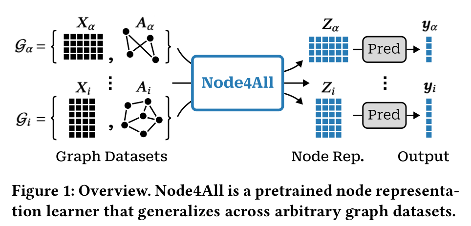
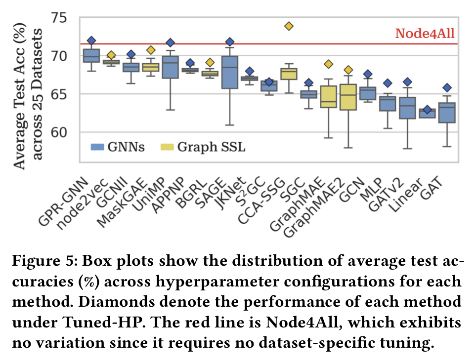

# Node4All: Learning Node Representation Beyond Datasets

This repository is the official implementation of **[Node4All: Learning Node Representation Beyond Datasets](docs/node4all_kdd_2026.pdf)**. It provides a synthetic graph pretraining pipeline and channel-wise graph encoders for fully inductive node representation learning across graph datasets with heterogeneous feature spaces.

Node4All studies node representation learning beyond a fixed dataset: a shared encoder should transfer to unseen graphs whose node count, graph structure, feature dimensionality, and feature semantics differ from the pretraining source. The implementation pretrains an encoder on synthetic Node4All graphs, freezes the encoder during adaptation, and trains lightweight dataset-specific predictors for downstream node classification.

## Method Overview

<table>
  <tr>
    <td align="center" width="50%">
      
    </td>
    <td align="center" width="50%">
      
    </td>
  </tr>
</table>

- **Node4All graph generator**: Samples synthetic graphs with variable node counts, degree statistics, feature dimensions, semantic dimensions, hidden dimensions, and feature propagation patterns.
- **Channel-wise graph processing**: Processes scalar feature channels with shared parameters so the encoder can support arbitrary input feature dimensionality.
- **CGT encoder**: Uses multi-hop Channel Graph Transformer tokenization with configurable hop depths, filter counts, normalization types, and self-loop handling.
- **Self-supervised pretraining**: Trains the shared encoder/decoder with masked autoencoding and DropNode on Node4All synthetic graphs.
- **Frozen adaptation**: Loads the pretrained encoder checkpoint, builds node embeddings on each target graph, and trains only a lightweight downstream predictor.
- **Evaluation variants**: Supports standard node-classification adaptation, one-shot node-classification evaluation, TabPFN node-classification evaluation, and visualization-only runs.

## Repository Pipeline

The entry point is [`main.py`](main.py).

1. **Stage 1: pretraining**
   Train the shared encoder on the synthetic Node4All source distribution and save the encoder checkpoint.

2. **Stage 2: adaptation and evaluation**
   Load the frozen encoder checkpoint, generate node representations for target datasets, train a lightweight predictor, and save per-dataset and aggregate summaries.

3. **Visualization mode**
   Load a pretrained encoder and save embedding visualizations for the pretraining graph and selected downstream datasets.

## Datasets

The dataset registry in [`dataset_utils/dataset_registry.py`](dataset_utils/dataset_registry.py) contains 25 node-classification transfer benchmarks:

- 1 OGB dataset: OGBN-Arxiv.
- 11 heterophilous graph datasets: Actor, Amazon Ratings, Chameleon, Cornell, Minesweeper, Questions, Roman Empire, Squirrel, Texas, Tolokers, and Wisconsin.
- 13 PyG datasets: Cora, CiteSeer, PubMed, WikiCS, CoraFull, Coauthor CS, Coauthor Physics, Amazon Computers, Amazon Photo, DBLP, Wiki, BlogCatalog, and Deezer Europe.

The synthetic `node4all` source is used for pretraining by default. Stage 2 evaluates all registered node-classification datasets unless a smaller dataset list is provided with `--node_level_datasets`.

## Evaluation Snapshot

Node4All is evaluated across 25 node-classification benchmarks against 21 per-dataset optimized baselines. The red line shows the single frozen Node4All encoder applied uniformly across datasets without dataset-specific training or hyperparameter tuning.

## Quick Start

### Environment setup

```bash
conda env create -f env.yml
conda activate cgt_env
```

### Adapt with the provided encoder checkpoint

```bash
python main.py \
  --mode adaptation \
  --enc_checkpoint checkpoints/cgt_enc.pth
```

The repository includes a pretrained CGT encoder at [`checkpoints/cgt_enc.pth`](checkpoints/cgt_enc.pth).

### Run the full pipeline

```bash
python main.py \
  --mode both \
  --datasetA node4all \
  --enc_checkpoint checkpoints/cgt_enc.pth
```

### Pretrain only

```bash
python main.py \
  --mode pretrain \
  --datasetA node4all \
  --enc_checkpoint checkpoints/cgt_enc.pth
```

### Visualize embeddings

```bash
python main.py \
  --mode visualize \
  --datasetA node4all \
  --enc_checkpoint checkpoints/cgt_enc.pth
```

### Evaluate selected datasets

```bash
python main.py \
  --mode adaptation \
  --enc_checkpoint checkpoints/cgt_enc.pth \
  --node_level_datasets 12_cora 9_citeseer 27_ogbn_arxiv
```

## Repository Structure

- [`main.py`](main.py): Unified entry point for `pretrain`, `adaptation`, `both`, and `visualize` modes.
- [`pretrain/`](pretrain): Stage 1 self-supervised pretraining.
- [`adaptation/`](adaptation): Stage 2 node-classification adaptation, one-shot evaluation, and TabPFN evaluation.
- [`channel_models/`](channel_models): Channel-wise encoder backbones, including CGT, channel-wise GCN, and channel-wise GAT.
- [`dataset_utils/`](dataset_utils): Dataset registry, dataset loading utilities, and the synthetic Node4All generator.
- [`models/`](models): Predictor backbones used during adaptation.
- [`predict/`](predict): TabPFN predictor utilities.
- [`utils/`](utils): Logging, summarization, plotting, and WandB helpers.
- [`assets/`](assets): README figures extracted from the paper.
- [`docs/`](docs): Dataset statistics and full experimental result PDFs.
- [`visualize_mode.py`](visualize_mode.py): Visualization-only pipeline for learned embeddings.
- [`env.yml`](env.yml): Conda environment specification.

## Documentation

- [KDD 2026 paper](docs/node4all_kdd_2026.pdf)
- [Dataset statistics](docs/dataset_stats.pdf)
- [Full experimental results](docs/full_exp_results.pdf)

## Outputs

By default, experiment outputs are written under timestamped folders in `results/`.

- Stage 2 node-classification summaries are saved under `results/<run_name>/node_level/`.
- One-shot summaries are saved under `results/<run_name>/node_level_one_shot/` when enabled.
- TabPFN summaries are saved under `results/<run_name>/node_level_tabpfn/` when enabled.
- Aggregate summaries are generated by [`utils/summary.py`](utils/summary.py).
- Visualization outputs are saved through the plotting utilities in [`utils/plots/`](utils/plots).

## Citation

Citation details will be added after the paper is officially published.

## Contact

For questions or feedback, please open an issue in this repository or contact dooho@kaist.ac.kr.
